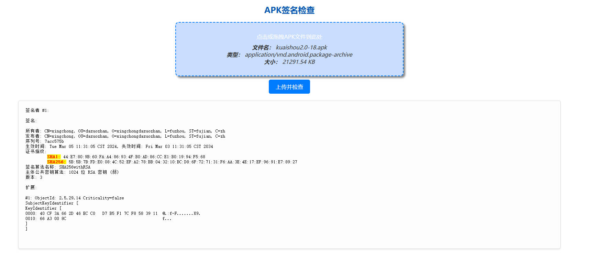

# 写在最前面

1. 项目是在 https://github.com/Ed1s0nZ/APK-SignCheck 基础上优化的,了解更多可以查看原作者
2. 因为原作者的页面只能点击按钮上传, 比较不方便, 我优化了一版
3. 还有因为原来的页面跳转, 上传会出现意外, 还有上传过程中没有响应,体验较差
4. 基于以上原因优化, 目前只能在windows平台使用, 请不要构建linux
5. 如果有优化,或者需求,可以提交issues,我可能会修改

# APK签名检查工具

此工具旨在简化APK文件签名的查看过程，通过一个简单易用的Web界面，使非技术人员也能轻松查看APK文件的签名信息。

## 功能简介

本工具通过Web端接收上传的APK文件，后端运行`keytool -printcert -jarfile <apk>`命令后，将签名信息显示在Web页面上，简化了签名检查流程。

## 快速开始, 要使用此工具，请按以下步骤操作：

1. **配置java环境** 配置java1.8及以上的配置环境, 在cmd命令行中用java 和javac 查看java环境是否配置好,必须步骤
2. **设置端口**：修改`main.go`文件中的`http.ListenAndServe(":9999", nil)`，将`:9999`替换为所需的端口号。
3. **编译程序**：在命令行中运行`go build main.go`。
4. **启动服务**：通过访问`IP:Port`（替换为实际的IP地址和你设置的端口）来启动Web服务。
5. **上传APK文件**：在Web界面中上传你的APK文件。
6. **检查签名**：点击`上传并检查`按钮，查看签名信息。

## 缘起

为了给非技术人查看apk的签名

## 页面效果

